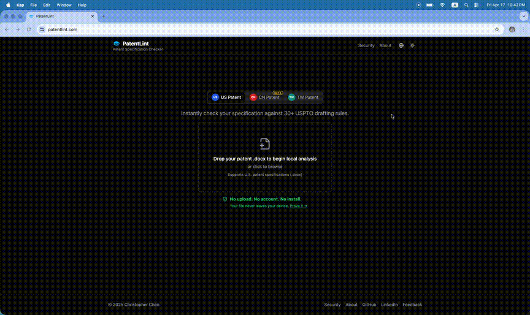

# PatentLint

[](https://github.com/kwisschen/Patent-Lint/actions/workflows/ci.yml)
[](https://patentlint.com)
[](LICENSE)
[](#)

**No install. No account. No cloud upload.**

PatentLint checks U.S. patent application drafts (.docx) against USPTO formatting rules and MPEP guidelines — entirely in your browser. Your file never leaves your device.

**[Try it →](https://patentlint.com)**


### Zero-Trust Proof

> Your documents never leave your browser — verifiable in airplane mode.



---

## How It Works

1. **Drop** a .docx patent draft into the browser
2. **Analyze** — 33 checks run instantly via WebAssembly (no server, no upload)
3. **Report** — download a PDF or copy a summary to clipboard

---

## Security

PatentLint's analysis engine is compiled to WebAssembly and runs entirely in your browser tab. No server receives your file. No network requests are made during analysis.

**You don't have to take our word for it.** Turn on airplane mode after your first visit, drop a file, and watch it work. [See the proof →](https://patentlint.com/security)

---

## What It Checks

33 automated checks across four sections, each classified as **PASS**, **VERIFY**, or **AMEND**.

| Section | Checks | Reference |
|---------|--------|-----------|
| **Specification** | Required sections, paragraph numbering, restrictive wording, sequence listing, prior art citations, figure cross-reference consistency | MPEP § 608.01(a)(m)(p), § 2173.01 |
| **Drawings** | Figure count, sequential numbering, single-figure format, prior art labeling, reference numeral consistency (spec ↔ drawings) | MPEP § 608.02 |
| **Claims** | Numbering, dependencies, periods, punctuation, indefinite terms, transitional phrases, means-plus-function (§ 112(f)), antecedent basis (§ 112(b)), preamble consistency (§ 112(d)), specification support (§ 112(a)), claim similarity, special formats (Jepson / CRM / Markush / omnibus) | 35 U.S.C. § 101, § 112; MPEP § 2117–2173 |
| **Abstract** | Word count (50–150), single paragraph, legal phraseology, implied phrases, self-praising language | MPEP § 608.01(b) |

Full inventory: [CHECKS.md](CHECKS.md)

---

## Deployment Tiers

| Tier | Analysis | PDF | Server? | Trust Model |
|------|----------|-----|---------|-------------|
| **Web** (default) | Pyodide/WASM in browser | pdfmake (client-side) | No — static hosting | Zero-trust: airplane mode verifiable |
| **Docker** | Local FastAPI | weasyprint | Yes (your machine) | On-premise |
| **Cloud API** (future) | Hosted FastAPI | weasyprint | Yes (our infra) | Process + discard |

---

## Architecture

```
                         ┌──────────────────────┐
                         │   React Frontend     │
                         │  (Vite + shadcn/ui)  │
                         └─────┬──────────┬─────┘
               Web (default)   │          │   Docker / CLI
          ┌────────────────────┘          └──────────────────┐
          ▼                                                  ▼
┌──────────────────┐                              ┌──────────────────┐
│  Pyodide/WASM    │                              │  FastAPI (app.py) │
│  (in-browser     │                              └────────┬─────────┘
│   analysis)      │                                       │
└────────┬─────────┘                              ┌────────▼─────────┐
         │                                        │  pipeline.py     │
         │         ┌───────────────────────┐      │  analyze_file()  │
         └────────►│  parser/ + analysis/  │◄─────┘  analyze_bytes() │
                   │  (pure Python, zero   │      └──────────────────┘
                   │   framework deps)     │
                   └───────────────────────┘
                              │
              ┌───────────────┼───────────────┐
              ▼               ▼               ▼
    ┌──────────────┐ ┌──────────────┐ ┌──────────────┐
    │   pdfmake    │ │  weasyprint  │ │  Click CLI   │
    │ (web, client)│ │ (Docker/CLI) │ │  (cli.py)    │
    └──────────────┘ └──────────────┘ └──────────────┘
```

```
src/patentlint/
├── models.py        # Pydantic models (Claim, AnalysisResult, ReportData)
├── pipeline.py      # Analysis pipeline (zero web-framework deps)
├── cli.py           # Click CLI (analyze, batch)
├── parser/          # Section extraction, claim parsing, .docx loading
├── analysis/        # Rule checks — all pure functions, independently testable
├── report/          # PDF report generation (Jinja2 + weasyprint)
└── api/             # FastAPI REST endpoints

frontend/
├── src/components/  # DropZone, ClaimTree, TriagePanel, HealthDonut, …
├── src/lib/         # pdfExport.js (client-side PDF via pdfmake)
├── src/pages/       # SecurityPage, AboutPage
├── src/hooks/       # usePyodide, useNetworkMonitor
└── src/i18n/        # Locale files (en, zh-TW, zh-CN, ja)
```

The `parser/` and `analysis/` packages have **zero framework dependencies** — they run identically in Pyodide (browser), FastAPI (Docker), and Click (CLI).

---

## Quick Start

### Web (recommended)

Visit **[patentlint.com](https://patentlint.com)** — nothing to install.

### Local Development

**Prerequisites:** Python 3.12+, Node.js 22+, pango (`brew install pango` on macOS)

```bash
# Backend
pip install -e ".[api,dev]"
pytest -v                    # 388 tests
uvicorn patentlint.api.app:app --port 8000 --reload

# Frontend (separate terminal)
cd frontend && npm install && npm run dev
# → http://localhost:5173
```

### CLI

```bash
patentlint analyze patent-draft.docx                             # JSON to stdout
patentlint analyze patent-draft.docx -o report.json              # JSON to file
patentlint analyze patent-draft.docx --format pdf -o report.pdf  # PDF report
patentlint batch ./patents/ --output ./reports/                  # Batch mode
```

Exit codes: `0` clean, `1` findings, `2` error.

### Docker

```bash
docker build -t patentlint .
docker run -p 8000:8000 patentlint
# → http://localhost:8000 (web UI + API)
```

### REST API

```bash
curl -X POST http://localhost:8000/api/analyze -F "file=@draft.docx"
curl -X POST http://localhost:8000/api/analyze?format=report -F "file=@draft.docx"
curl -X POST http://localhost:8000/api/analyze/report -F "file=@draft.docx" -o report.pdf
curl http://localhost:8000/api/health
```

---

## Tech Stack

| Layer | Technology |
|-------|-----------|
| Analysis Engine | Python 3.12 (pure functions, zero framework deps) |
| Client-Side Runtime | Pyodide 0.27.7 (CPython → WebAssembly) |
| Backend | FastAPI, Pydantic (Docker/CLI tier) |
| Frontend | React 18, Vite 6, Tailwind CSS v4, shadcn/ui |
| PDF | pdfmake (web) · weasyprint (Docker/CLI) |
| CLI | Click |
| Testing | pytest (388 tests) |
| CI/CD | GitHub Actions → Cloudflare Pages |
| i18n | react-i18next (English, 繁體中文, 简体中文, 日本語) |

---

## Languages

PatentLint's UI is available in four languages. Patent-specific terms follow official terminology from each jurisdiction's patent office.

| Language | Patent Office | Terminology Standard |
|----------|--------------|---------------------|
| English | USPTO | MPEP |
| 繁體中文 | TIPO (經濟部智慧財產局) | 專利審查基準 |
| 简体中文 | CNIPA (国家知识产权局) | 专利审查指南 |
| 日本語 | JPO (特許庁) | 特許・実用新案審査基準 |

---

## Disclaimer

This tool does not constitute legal advice. All findings should be reviewed by a qualified patent professional before filing.

## License

AGPL-3.0-only — see [LICENSE](LICENSE) for details.

© 2025 Christopher Chen
